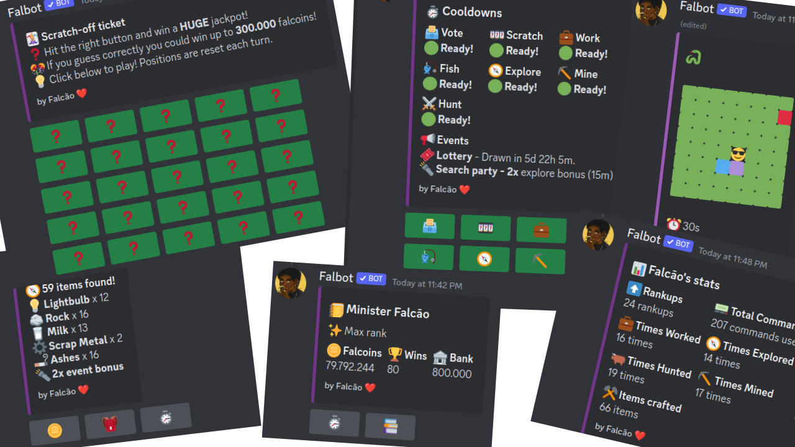

<h1 align="center"> Falbot 🪙 </h1>
<blockquote>

<i>
Falbot is a fun brazilian bot, with the focus point being enconomy, which includes a lot of other features and systems, such as gambling, inventory, progression, competitive commands, and much more. 

Don’t miss the opportunity to have a unique and enriching experience on your Discord server with Falbot!
</i>

</blockquote>

    
    
    
    
    

## 🚀 Features

- 🎲 Gamble commands
- ⚔️ Competitive commands
- 📈 Engaging rank-up and progression system
- 🏛️ Dynamic economy run by player activity
- 🎒 In-depth inventory and crafting system
- 👑 Global and local user leaderboards
- 🎉 Fun commands
- ⚙️ Useful commands
- 🌎 All features available in both portuguese and english

Add him by clicking [here](https://discord.com/oauth2/authorize?client_id=742331813539872798&permissions=330816&scope=bot%20applications.commands)

Support server: <https://discord.gg/8WrAtVYVKR>

Official website: <https://falbot.netlify.app/>

## 📷 Preview

## ❓ Want to contribute?

If you want to contribute, please read the [contributing guide](CONTRIBUTING.md).
